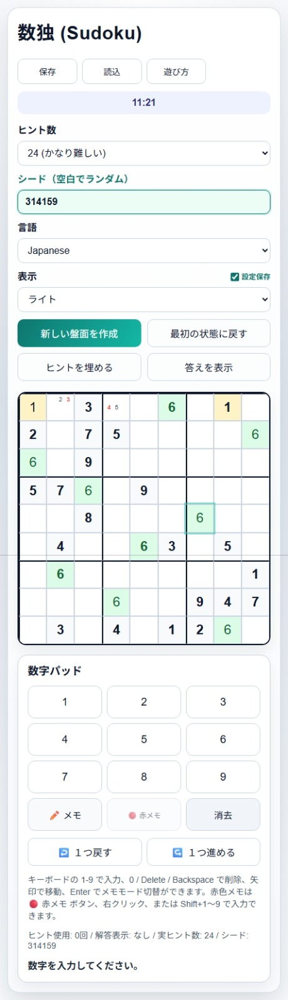

# 数独ゲームガイド

| デスクトップ表示 | モバイル表示 |
| --- | --- |
|  |  |

## 遊び方

- 盤面のマスを選んで、1から9までの数字を入力してください。
- タテ、ヨコ、太線で囲まれた3x3のブロックのどれにも、1から9までの数字が1つずつ入れば完成です。
- 生成される盤面はすべて、正解は1つのみです。
- 重複する数字と、9個すべて正しく埋まった数字は、ハイライト表示されます。
- オフラインで遊べます。ゲームプレイ中の操作はインターネット通信を生じさせません。

## 盤面上部にあるコントロールとボタン

- `ヒント数`: 次に作る盤面の初期ヒント数を設定します。
- `シード`: 同じ値を入れると同じ盤面を再生成できます。空欄ならランダムです。
- `言語`: 画面表示の言語を切り替えます。
- `表示`: 「システム設定」「ライト」「ダーク」から選べます。「システム設定」ではOSのカラーモードに自動追従します。
- `設定保存`: ONにすると、ヒント数、シード、言語、表示をこのブラウザに保存します。初期状態はOFFです。
- `新しい盤面を作成`: 現在のヒント数とシードで新しい盤面を生成します。
- `最初の状態に戻す`: 開始時点の盤面に戻します。タイマーも最初からやり直します。
- `ヒントを埋める`: 空きマス 1 つに正解を入れます。
- `答えを表示`: 完成した解答を表示します。
- `保存`: 現在の盤面、メモ、タイマー、Undo/Redo の履歴を JSON ファイルとして保存します。
- `読込`: 保存した JSON ファイルを読み込み、同じ状態から再開します。
- `使い方`: ヘルプを開きます。オフラインで読めます。

## ブラウザに保存される設定

- 初期状態では `設定保存` はOFFで、設定はブラウザに保存されません。
- `設定保存` をONにすると、ONであること自体と `ヒント数`、`シード`、`言語`、`表示`をブラウザのローカルストレージに保存し、次回起動時に復元します。
- `設定保存` をOFFに戻すと、これらの保存済み設定をすべて削除します。シードが空欄の場合は、ONでもシード値は保存されません。
- これは `保存` ボタンによるゲーム状態 JSON とは別です。現在の盤面、メモ、タイマー、Undo/Redo 履歴は自動保存されません。

## 操作方法（マウス/タップ）

- 盤面のマスを選びます。
- 数字パッドで数字を入力します。
- `消去`: 選択中のマスを消去
- `✏️ メモ`: メモ入力モードに切り替え（メモ入力モード中に数字を入力するとメモを入れられます。）
- `🔴 赤メモ`: メモ入力を赤色メモに切り替え（メモ入力モード中に数字をマウスで右クリックしても赤色メモを入れられます。）
- `↩️ １つ戻す`: 直前の入力やメモを取り消し
- `↪️ １つ進める`: 取り消した入力やメモをやり直し

## 操作方法（キーボード）

- 矢印キー: 盤面のマスを移動
- `1`〜`9`: 数字を入力
- `0` / `Backspace` / `Delete`: 選択中のマスを消去
- `Enter`: メモ入力モードに切り替え
- `Shift+1`〜`9`: 赤色メモを入力
- `Ctrl+Z`: 1つ戻す
- `Ctrl+Y` または `Ctrl+Shift+Z`: 1つ進める
